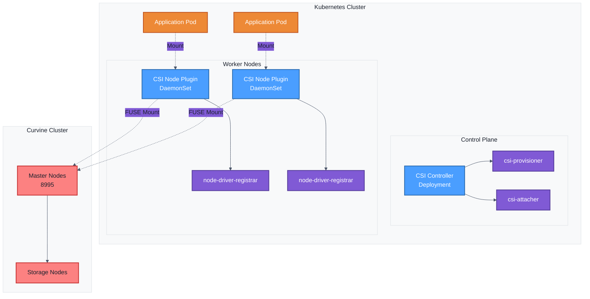

# Installation Guide
To facilitate quick integration with Curvine in cloud-native environments, Curvine provides CSI driver support. Your Pod containers can access Curvine through `PV` (Persistent Volume) without requiring application modifications, enabling seamless use of Curvine's caching capabilities.

The Curvine CSI driver follows the standard CSI specification and includes:
- `CSI Controller`, deployed in `Deployment` or `Statefulset` mode
- `CSI Node Plugin`, deployed in `DaemonSet` mode

## Architecture Overview

The Curvine CSI driver adopts the standard CSI architecture with two main components:



### Core Components

1. **CSI Controller**
   - Runs in the Control Plane
   - Responsible for Volume creation, deletion, Attach/Detach operations
   - Includes csi-provisioner and csi-attacher sidecars

2. **CSI Node Plugin**
   - Runs as DaemonSet on each Worker Node
   - Responsible for mounting Curvine storage to Pods
   - Uses FUSE technology for filesystem mounting

3. **FUSE Mounting Mechanism**
   - Directly mounts Curvine filesystem paths
   - Same paths share FUSE process, saving resources
   - Supports concurrent access by multiple Pods

---

## Prerequisites

### Environment Requirements

- Kubernetes 1.19+
- Helm 3.0+
- Accessible Curvine cluster (Master node address and port)
- Cluster administrator privileges

### Environment Check

```bash
# Check Kubernetes version
kubectl version --short

# Check Helm version
helm version --short

# Check node status
kubectl get nodes
```

---

## I. Installing Curvine CSI

### 1.1 Get Helm Chart

```bash
helm repo add curvine https://curvineio.github.io/helm-charts
helm repo update
helm search repo curvine --devel
helm install curvine-csi curvine/curvine-csi \ 
    --namespace curvine \ 
    --create-namespace --devel \ 
    --version 0.0.1-dev+7ffc6a2
```


:::tip
The current Curvine Helm repository provides pre-release versions:
- Use `--devel` to view them, and replace the `--version` in the command above with your desired version
- curvine-csi is installed by default in the `curvine` namespace via Helm
- Official release versions will be provided progressively
:::

### 1.2 Configure Custom Parameters (Optional)
curvine-csi supports rich customization parameters. If your network environment has restrictions, you can use custom images and other methods.

For example, create a `custom-values.yaml` file:

```yaml
# Image configuration
image:
  repository: ghcr.io/curvineio/curvine-csi
  tag: latest
  pullPolicy: IfNotPresent

# Controller configuration
controller:
  replicas: 1
  resources:
    requests:
      cpu: 100m
      memory: 128Mi
    limits:
      cpu: 500m
      memory: 512Mi

# Node configuration - Standalone mode (default)
node:
  mountMode: standalone
  standalone:
    image: ""
    resources:
      requests:
        cpu: 500m
        memory: 512Mi
      limits:
        cpu: 2
        memory: 2Gi
```

Or use Embedded mode:

```yaml
# Node configuration - Embedded mode
node:
  mountMode: embedded
  resources:
    requests:
      cpu: 1000m
      memory: 2Gi
    limits:
      cpu: 2000m
      memory: 4Gi
```

Install with custom parameters using Helm:
```bash
helm install curvine-csi curvine/curvine-csi \ 
    --namespace curvine \ 
    --create-namespace --devel \ 
  --values custom-values.yaml

# Check installation status
helm status curvine-csi -n curvine
```

:::tip
By default, curvine-csi uses `standalone` mode, where FUSE mounts run in independent pods unaffected by curvine-csi restarts (recommended). It also supports `embedded` mode. For architecture details and Helm configuration parameters, refer to [Curvine CSI Architecture](Framework).
:::

### 1.4 Upgrade and Uninstall

```bash
# Upgrade
helm upgrade curvine curvine/curvine-csi -n curvine --devel --version xxxxx

# Uninstall
helm uninstall curvine-csi -n curvine

# Complete cleanup (including namespace)
kubectl delete namespace curvine
```

---

## II. Verification and Status Check

### 2.1 Check CSI Driver Registration

```bash
# Check if CSI Driver is registered successfully
kubectl get csidriver curvine

# Example output:
# NAME      ATTACHREQUIRED   PODINFOONMOUNT   STORAGECAPACITY
# curvine   false            false            false
```

**Parameter Explanation:**
- `ATTACHREQUIRED: false` - No Attach operation needed (direct FUSE mount)
- `PODINFOONMOUNT: false` - No Pod information needed during mount

### 2.2 Check Controller Status

```bash
# Check Controller Deployment
kubectl get deployment -n curvine curvine-csi-controller

# Check Controller Pod
kubectl get pods -n curvine -l app=curvine-csi-controller

# Check Controller logs
kubectl logs -n curvine \
  -l app=curvine-csi-controller \
  -c csi-plugin \
  --tail=50

# Check Provisioner Sidecar logs
kubectl logs -n curvine \
  -l app=curvine-csi-controller \
  -c csi-provisioner \
  --tail=50
```

### 2.3 Check Node Plugin Status

```bash
# Check Node DaemonSet
kubectl get daemonset -n curvine curvine-csi-node

# Check all Node Plugin Pods
kubectl get pods -n curvine -l app=curvine-csi-node -o wide

# Check specific Node logs
kubectl logs -n curvine curvine-csi-node-xxxxx -c csi-plugin

# Check Node Registrar logs
kubectl logs -n curvine curvine-csi-node-xxxxx -c node-driver-registrar
```

## III. StorageClass Explained

StorageClass is a resource in Kubernetes that defines storage types, used for automatic creation of dynamic PVs.

### 3.1 StorageClass Configuration Example

```yaml
apiVersion: storage.k8s.io/v1
kind: StorageClass
metadata:
  name: curvine-sc
provisioner: curvine                      # CSI driver name
reclaimPolicy: Delete                     # Reclaim policy
volumeBindingMode: Immediate              # Binding mode
allowVolumeExpansion: true                # Allow expansion
parameters:
  # Required: Curvine cluster connection information
  master-addrs: "master1:8995,master2:8995,master3:8995"
  
  # Required: Filesystem path prefix
  fs-path: "/k8s-volumes"
  
  # Optional: Path creation strategy
  path-type: "DirectoryOrCreate"
  
  # Optional: FUSE parameters
  io-threads: "4"
  worker-threads: "8"
```

### 3.2 Parameter Details

#### Core Parameters

| Parameter | Required | Description | Example |
|-----|------|------|------|
| `master-addrs` | ✅ | Curvine Master node address list, comma-separated | `"10.0.0.1:8995,10.0.0.2:8995"` |
| `fs-path` | ✅ | Path prefix for dynamic PVs, actual path is `fs-path + pv-name` | `"/k8s-volumes"` |
| `path-type` | ❌ | Path creation strategy, defaults to `Directory` | `"DirectoryOrCreate"`(Automatically creates path if it doesn't exist); `"Directory"`(Path must already exist) |
| `reclaimPolicy` | ❌ | PV reclaim policy, defaults to `Delete` | `"Delete"`(Automatically deletes PV and storage data when PVC is deleted); `"Retain"`(PV is retained after PVC deletion) |
| `Binding Mode` | ❌ | PV binding mode, defaults to `Immediate` | `"Immediate"`(PV is bound immediately after PVC creation); `"WaitForFirstConsumer"`(Waits for Pod scheduling before binding PV) |
| `io-threads` | ❌ | FUSE IO thread count | `"4"` |
| `worker-threads` | ❌ | FUSE worker thread count | `"8"` |

### 3.3 Dynamic PV Path Generation Rules

```
Actual mount path = fs-path + "/" + pv-name
```

**Example:**
```yaml
# StorageClass configuration
fs-path: "/k8s-volumes"

# Auto-generated PV name
pv-name: "pvc-1234-5678-abcd"

# Final Curvine path
Actual path: "/k8s-volumes/pvc-1234-5678-abcd"
```

### 3.4 Create StorageClass

Create the `storageclass.yaml` file:

```yaml
apiVersion: storage.k8s.io/v1
kind: StorageClass
metadata:
  name: curvine-sc
provisioner: curvine
reclaimPolicy: Delete
volumeBindingMode: Immediate
allowVolumeExpansion: true
parameters:
  master-addrs: "m0:8995,m1:8995,m2:8995"
  fs-path: "/k8s-volumes"
  path-type: "DirectoryOrCreate"
```

Apply the configuration:

```bash
# Create StorageClass
kubectl apply -f storageclass.yaml

# View StorageClass
kubectl get storageclass curvine-sc

# Set as default StorageClass (optional)
kubectl patch storageclass curvine-sc \
  -p '{"metadata": {"annotations":{"storageclass.kubernetes.io/is-default-class":"true"}}}'
```

:::tip
Replace the `master-addrs` in the example above with your actual master addresses.
:::

### 3.5 Multiple StorageClass Scenarios

You can create multiple StorageClasses for different scenarios:

```yaml
# Production environment - strict mode
---
apiVersion: storage.k8s.io/v1
kind: StorageClass
metadata:
  name: curvine-prod
provisioner: curvine
reclaimPolicy: Retain
volumeBindingMode: WaitForFirstConsumer
parameters:
  master-addrs: "prod-master1:8995,prod-master2:8995"
  fs-path: "/production"
  path-type: "Directory"

# Development environment - relaxed mode
---
apiVersion: storage.k8s.io/v1
kind: StorageClass
metadata:
  name: curvine-dev
provisioner: curvine
reclaimPolicy: Delete
volumeBindingMode: Immediate
parameters:
  master-addrs: "dev-master:8995"
  fs-path: "/development"
  path-type: "DirectoryOrCreate"
```

---

## IV. Static PV Usage

Static PV is used to mount existing data directories in Curvine, suitable for the following scenarios:
- Multiple clusters sharing the same data
- Need for precise control over data paths

### 4.1 Working Principle

```mermaid
%%{init: {'theme': 'base', 'themeVariables': { 'background': '#ffffff', 'primaryColor': '#4a9eff', 'primaryTextColor': '#1a202c', 'primaryBorderColor': '#3182ce', 'lineColor': '#4a5568', 'secondaryColor': '#805ad5', 'tertiaryColor': '#38a169', 'mainBkg': '#ffffff', 'nodeBorder': '#4a5568', 'clusterBkg': '#f8f9fa', 'clusterBorder': '#dee2e6', 'titleColor': '#1a202c'}}}%%
flowchart LR
    Start[Curvine cluster has existing data] --> CreatePV[Administrator creates PV<br/>specifying curvine-path]
    CreatePV --> CreatePVC[User creates PVC<br/>binds to specified PV]
    CreatePVC --> StandalonePod[Pod mounts PVC]
    
    %% Styles
    classDef storageStyle fill:#fc8181,stroke:#c53030,color:#1a202c,stroke-width:2px
    classDef adminStyle fill:#4a9eff,stroke:#2b6cb0,color:#fff,stroke-width:2px
    classDef userStyle fill:#805ad5,stroke:#553c9a,color:#fff,stroke-width:2px
    classDef appStyle fill:#ed8936,stroke:#c05621,color:#fff,stroke-width:2px
    
    class Start storageStyle
    class CreatePV adminStyle
    class CreatePVC userStyle
    class StandalonePod appStyle
```



### 4.2 Create Static PV

```yaml
apiVersion: v1
kind: PersistentVolume
metadata:
  name: curvine-pv-existing-data
  labels:
    type: curvine-static
spec:
  storageClassName: curvine-sc
  capacity:
    storage: 100Gi                    # Declared capacity
  accessModes:
    - ReadWriteMany                   # Supports multi-Pod read-write
  persistentVolumeReclaimPolicy: Retain  # Retain data
  csi:
    driver: curvine
    volumeHandle: "existing-data-volume-001"  # Unique identifier
    volumeAttributes:
      # Required: Curvine Master address
      master-addrs: "m0:8995,m1:8995,m2:8995"
      
      # Required: Complete path in Curvine
      curvine-path: "/production/user-data"
      
      # Recommended: Use Directory to ensure path exists
      path-type: "Directory"
      
      # Optional: FUSE parameters
      io-threads: "4"
      worker-threads: "8"
```

**Parameter Explanation:**
- `volumeHandle`: Any unique string, used to identify the PV
- `curvine-path`: Complete path in Curvine filesystem, must already exist
- `path-type: Directory`: Requires path to exist (recommended)

### 4.3 Create Static PVC

```yaml
apiVersion: v1
kind: PersistentVolumeClaim
metadata:
  name: curvine-pvc-existing-data
  namespace: default
spec:
  storageClassName: curvine-sc
  accessModes:
    - ReadWriteMany
  resources:
    requests:
      storage: 100Gi
  # Key: Specify the PV name to bind
  volumeName: curvine-pv-existing-data
```

### 4.4 Verify Binding

```bash
# Check PV status
kubectl get pv curvine-pv-existing-data
# STATUS should be Bound

# Check PVC status
kubectl get pvc curvine-pvc-existing-data
# STATUS should be Bound

# Check detailed information
kubectl describe pvc curvine-pvc-existing-data
```

### 4.5 Using Static PV in Pod

```yaml
apiVersion: v1
kind: Pod
metadata:
  name: static-pv-test
spec:
  containers:
  - name: app
    image: nginx:alpine
    volumeMounts:
    - name: data
      mountPath: /data
  volumes:
  - name: data
    persistentVolumeClaim:
      claimName: curvine-pvc-existing-data
```

## V. Dynamic PV Usage

Dynamic PV is the most commonly used method, automatically created and managed by the CSI Controller.

### 5.1 Working Principle

```mermaid
%%{init: {'theme': 'base', 'themeVariables': { 'background': '#ffffff', 'primaryColor': '#4a9eff', 'primaryTextColor': '#1a202c', 'primaryBorderColor': '#3182ce', 'lineColor': '#4a5568', 'secondaryColor': '#805ad5', 'tertiaryColor': '#38a169', 'mainBkg': '#ffffff', 'nodeBorder': '#4a5568', 'clusterBkg': '#f8f9fa', 'clusterBorder': '#dee2e6', 'titleColor': '#1a202c'}}}%%
flowchart LR
    CreatePVC[User creates PVC<br/>specifying StorageClass] --> AutoCreatePV[CSI Provisioner<br/>automatically creates PV]
    AutoCreatePV --> GenPath[Auto-generates Curvine path<br/>fs-path + pv-name]
    GenPath --> AutoBind[PVC automatically binds to PV]
    AutoBind --> StandalonePod[Pod mounts PVC for use]
    
    %% Styles
    classDef userStyle fill:#805ad5,stroke:#553c9a,color:#fff,stroke-width:2px
    classDef csiStyle fill:#4a9eff,stroke:#2b6cb0,color:#fff,stroke-width:2px
    classDef pathStyle fill:#48bb78,stroke:#276749,color:#fff,stroke-width:2px
    classDef bindStyle fill:#ecc94b,stroke:#b7791f,color:#1a202c,stroke-width:2px
    classDef appStyle fill:#ed8936,stroke:#c05621,color:#fff,stroke-width:2px
    
    class CreatePVC userStyle
    class AutoCreatePV csiStyle
    class GenPath pathStyle
    class AutoBind bindStyle
    class StandalonePod appStyle
```



### 5.2 Create Dynamic PVC

Dynamic PVC requires specifying a storageclass, without specifying volumeName:

```yaml
apiVersion: v1
kind: PersistentVolumeClaim
metadata:
  name: my-dynamic-pvc
  namespace: default
spec:
  storageClassName: curvine-sc    # Specify StorageClass
  accessModes:
    - ReadWriteOnce               # or ReadWriteMany
  resources:
    requests:
      storage: 10Gi               # Request capacity
```

### 5.3 Automatic Path Generation Example

```yaml
# StorageClass configuration
fs-path: "/k8s-volumes"

# PVC name
name: my-dynamic-pvc

# Auto-generated PV
# volumeHandle: pvc-1a2b3c4d-5e6f-7g8h-9i0j-k1l2m3n4o5p6

# Actual Curvine path
# /k8s-volumes/pvc-1a2b3c4d-5e6f-7g8h-9i0j-k1l2m3n4o5p6

# You can use Curvine's cv command to check if the volume was created correctly in the Curvine cluster
./bin/cv fs ls /
```

### 5.4 Dynamic PV Complete Example

Create the `dynamic-pvc.yaml` file:

```yaml
apiVersion: v1
kind: PersistentVolumeClaim
metadata:
  name: app-data-pvc
  namespace: default
spec:
  storageClassName: curvine-sc
  accessModes:
    - ReadWriteMany
  resources:
    requests:
      storage: 20Gi
```

Create the `dynamic-pv-pod.yaml` file:

```yaml
apiVersion: v1
kind: Pod
metadata:
  name: dynamic-pv-test
spec:
  containers:
  - name: app
    image: nginx:alpine
    volumeMounts:
    - name: data
      mountPath: /usr/share/nginx/html
  volumes:
  - name: data
    persistentVolumeClaim:
      claimName: app-data-pvc
```

Apply the configuration:

```bash
# 1. Create dynamic PVC
kubectl apply -f dynamic-pvc.yaml

# 2. Check PVC status (should automatically Bound)
kubectl get pvc app-data-pvc
kubectl describe pvc app-data-pvc

# 3. Check auto-created PV
kubectl get pv

# 4. Create Pod using PVC
kubectl apply -f dynamic-pv-pod.yaml

# 5. Test write and read
kubectl exec dynamic-pv-test -- sh -c 'echo "Hello Curvine" > /usr/share/nginx/html/index.html'
kubectl exec dynamic-pv-test -- cat /usr/share/nginx/html/index.html
```


## Appendix
### Helm Custom Parameters
#### Global Settings

| Parameter Path | Type | Default | Description |
|---------|------|--------|------|
| `global.namespace` | string | `curvine` | Namespace where CSI driver is deployed |

#### Image Settings

| Parameter Path | Type | Default | Description |
|---------|------|--------|------|
| `image.repository` | string | `ghcr.io/curvineio/curvine-csi` | CSI driver image repository address |
| `image.tag` | string | `latest` | CSI driver image tag version |
| `image.pullPolicy` | string | `Always` | Image pull policy (Always/IfNotPresent/Never) |

#### CSI Driver Settings

| Parameter Path | Type | Default | Description |
|---------|------|--------|------|
| `csiDriver.name` | string | `curvine` | CSI driver name identifier |
| `csiDriver.attachRequired` | boolean | `false` | Whether attach operation is required (volume attachment to node) |
| `csiDriver.podInfoOnMount` | boolean | `false` | Whether Pod information is required during mount |

#### Controller Settings

| Parameter Path | Type | Default | Description |
|---------|------|--------|------|
| `controller.name` | string | `curvine-csi-controller` | Controller Deployment name |
| `controller.replicas` | int | `1` | Number of Controller replicas |
| `controller.priorityClassName` | string | `system-cluster-critical` | Controller priority class name (high priority) |
| `controller.container.name` | string | `csi-plugin` | Main container name |
| `controller.container.command` | array | `["/opt/curvine/csi"]` | Container start command |
| `controller.container.args` | array | See values.yaml | Container start arguments |
| `controller.container.env.CSI_ENDPOINT` | string | `unix:///csi/csi.sock` | CSI socket endpoint address |
| `controller.container.livenessProbe.failureThreshold` | int | `5` | Liveness probe failure threshold |
| `controller.container.livenessProbe.httpGet.path` | string | `"/healthz"` | Liveness probe HTTP path |
| `controller.container.livenessProbe.httpGet.port` | string | `healthz` | Liveness probe HTTP port name |
| `controller.container.livenessProbe.initialDelaySeconds` | int | `10` | Liveness probe initial delay seconds |
| `controller.container.livenessProbe.periodSeconds` | int | `10` | Liveness probe check period (seconds) |
| `controller.container.livenessProbe.timeoutSeconds` | int | `3` | Liveness probe timeout (seconds) |
| `controller.container.ports.healthz` | int | `9909` | Health check port |
| `controller.container.securityContext.privileged` | boolean | `true` | Whether to run in privileged mode |
| `controller.container.securityContext.capabilities.add` | array | `[SYS_ADMIN]` | Added Linux Capabilities |
| `controller.tolerations` | array | See values.yaml | Pod toleration configuration (allows CriticalAddons scheduling) |

#### Controller Sidecar Container Configuration

| Parameter Path | Type | Default | Description |
|---------|------|--------|------|
| `controller.sidecars.provisioner.image` | string | `quay.io/k8scsi/csi-provisioner:v1.6.0` | Provisioner sidecar image |
| `controller.sidecars.provisioner.args` | array | See values.yaml | Provisioner arguments (timeout 60s, log level v5) |
| `controller.sidecars.attacher.image` | string | `registry.k8s.io/sig-storage/csi-attacher:v4.5.0` | Attacher sidecar image |
| `controller.sidecars.attacher.args` | array | See values.yaml | Attacher arguments (log level v5) |
| `controller.sidecars.livenessProbe.image` | string | `registry.k8s.io/sig-storage/livenessprobe:v2.11.0` | LivenessProbe sidecar image |
| `controller.sidecars.livenessProbe.args` | array | See values.yaml | LivenessProbe arguments |
| `controller.sidecars.livenessProbe.env.HEALTH_PORT` | string | `"9909"` | Health check port |

#### Node Settings

| Parameter Path | Type | Default | Description |
|---------|------|--------|------|
| `node.name` | string | `curvine-csi-node` | Node DaemonSet name |
| `node.priorityClassName` | string | `system-node-critical` | Node priority class name (node critical level) |
| `node.dnsPolicy` | string | `ClusterFirstWithHostNet` | DNS policy (cluster first + host network) |
| `node.fuseDebugEnabled` | boolean | `false` | Enable FUSE debug mode (sets FUSE_DEBUG_ENABLED env) |
| `node.mountMode` | string | `standalone` | Mount mode: `standalone` (independent pod) or `embedded` (embedded in CSI container) |
| `node.container.name` | string | `csi-plugin` | Main container name |
| `node.container.command` | array | `["/opt/curvine/csi"]` | Container start command |
| `node.container.args` | array | See values.yaml | Container start arguments |
| `node.container.env.CSI_ENDPOINT` | string | `unix:///csi/csi.sock` | CSI socket endpoint address |
| `node.container.livenessProbe.failureThreshold` | int | `5` | Liveness probe failure threshold |
| `node.container.livenessProbe.httpGet.path` | string | `"/healthz"` | Liveness probe HTTP path |
| `node.container.livenessProbe.httpGet.port` | string | `healthz` | Liveness probe HTTP port name |
| `node.container.livenessProbe.initialDelaySeconds` | int | `10` | Liveness probe initial delay seconds |
| `node.container.livenessProbe.periodSeconds` | int | `10` | Liveness probe check period (seconds) |
| `node.container.livenessProbe.timeoutSeconds` | int | `3` | Liveness probe timeout (seconds) |
| `node.container.ports.healthz` | int | `9909` | Health check port |
| `node.container.securityContext.privileged` | boolean | `true` | Whether to run in privileged mode |
| `node.container.lifecycle.preStop` | object | See values.yaml | Container pre-stop hook (cleanup socket files) |
| `node.tolerations` | array | `[{operator: Exists}]` | Pod toleration configuration (tolerates all taints) |

#### Standalone Pod Settings

When `node.mountMode` is set to `standalone`, the following settings apply:

| Parameter Path | Type | Default | Description |
|---------|------|--------|------|
| `node.standalone.image` | string | `""` | Standalone Pod image, empty uses CSI image |
| `node.standalone.resources.requests.cpu` | string | `"500m"` | CPU request |
| `node.standalone.resources.requests.memory` | string | `"512Mi"` | Memory request |
| `node.standalone.resources.limits.cpu` | string | `"2"` | CPU limit |
| `node.standalone.resources.limits.memory` | string | `"2Gi"` | Memory limit |

Example configuration:

```yaml
node:
  mountMode: standalone
  standalone:
    image: ""  # Empty uses CSI image
    resources:
      requests:
        cpu: "500m"
        memory: "512Mi"
      limits:
        cpu: "2"
        memory: "2Gi"
```

#### Node Sidecar Container Configuration

| Parameter Path | Type | Default | Description |
|---------|------|--------|------|
| `node.sidecars.nodeDriverRegistrar.image` | string | `quay.io/k8scsi/csi-node-driver-registrar:v2.1.0` | Node driver registrar image |
| `node.sidecars.nodeDriverRegistrar.args` | array | See values.yaml | Registrar arguments (log level v5) |
| `node.sidecars.nodeDriverRegistrar.env.ADDRESS` | string | `/csi/csi.sock` | CSI socket address |
| `node.sidecars.nodeDriverRegistrar.env.DRIVER_REG_SOCK_PATH` | string | `/var/lib/kubelet/csi-plugins/csi.curvine.io/csi.sock` | Driver registration path in Kubelet |
| `node.sidecars.livenessProbe.image` | string | `registry.k8s.io/sig-storage/livenessprobe:v2.11.0` | LivenessProbe sidecar image |
| `node.sidecars.livenessProbe.args` | array | See values.yaml | LivenessProbe arguments |
| `node.sidecars.livenessProbe.env.ADDRESS` | string | `/csi/csi.sock` | CSI socket address |
| `node.sidecars.livenessProbe.env.HEALTH_PORT` | string | `"9909"` | Health check port |

#### Node Host Path Configuration

| Parameter Path | Type | Default | Description |
|---------|------|--------|------|
| `node.hostPaths.pluginDir.path` | string | `/var/lib/kubelet/csi-plugins/csi.curvine.io/` | CSI plugin directory path |
| `node.hostPaths.pluginDir.type` | string | `DirectoryOrCreate` | Path type (create if not exists) |
| `node.hostPaths.kubeletDir.path` | string | `/var/lib/kubelet` | Kubelet working directory path |
| `node.hostPaths.kubeletDir.type` | string | `DirectoryOrCreate` | Path type (create if not exists) |
| `node.hostPaths.registrationDir.path` | string | `/var/lib/kubelet/plugins_registry/` | Plugin registration directory path |
| `node.hostPaths.registrationDir.type` | string | `Directory` | Path type (must exist) |

#### Service Account Settings

| Parameter Path | Type | Default | Description |
|---------|------|--------|------|
| `serviceAccount.controller.name` | string | `curvine-csi-controller-sa` | Controller service account name |
| `serviceAccount.node.name` | string | `curvine-csi-node-sa` | Node service account name |

#### RBAC Configuration

| Parameter Path | Type | Default | Description |
|---------|------|--------|------|
| `rbac.create` | boolean | `true` | Whether to create RBAC resources (ClusterRole/ClusterRoleBinding) |

#### StorageClass Parameters (Configured at Usage Time)

| Parameter Name | Required | Type | Default | Description |
|--------|---------|------|--------|------|
| `master-addrs` | **Required** | string | None | Curvine Master node addresses, format: `host:port,host:port` |
| `fs-path` | **Required** | string | None | Filesystem path prefix, each PV creates: `fs-path + pv-name` |
| `path-type` | Optional | string | `Directory` | Path creation strategy: `DirectoryOrCreate` or `Directory` |
| `io-threads` | Optional | string | None | FUSE IO thread count |
| `worker-threads` | Optional | string | None | FUSE worker thread count |